如果你想 **更快刷完 LeetCode**，可以采取 **“高频题 + 模板化 + 针对性突破”** 的策略，以下是一份 **30天高强度刷题计划**（每天5-10题），适合有基础且时间充裕的学习者：

---

### **🔥 极速刷题计划（30天版）**
**核心原则**：  
✅ **只刷高频题**（Top 300-500）  
✅ **同类题集中刷**（举一反三）  
✅ **背经典模板**（如DFS、DP、滑动窗口）  
✅ **80/20法则**（优先覆盖90%面试题）

---

### **📌 第一阶段：核心数据结构速通（7天）**
**目标**：1周内掌握高频数据结构题，每题限时15分钟。
| **分类**       | **必刷题目**（直接刷最高频的）              | **技巧**                  |
|----------------|-----------------------------------|--------------------------|
| **数组/字符串** | 1, 3, 15, 20, 76, 239, 560       | 双指针、滑动窗口、前缀和      |
| **链表**       | 206, 141, 21, 23, 160, 19, 142   | 虚拟头节点、快慢指针         |
| **哈希表**     | 1, 3, 49, 128, 560               | 用哈希优化查找O(1)          |
| **栈/队列**    | 20, 155, 232, 225, 239, 703      | 单调栈、双栈实现队列         |

**加速技巧**：  
➊ 同类题连续刷（如一天刷5道滑动窗口题）  
➋ 直接看优质题解（LeetCode官方题解/英文站高赞）  
➌ 抄写标准代码（理解后背默）

---

### **📌 第二阶段：算法模板强化（10天）**
**目标**：掌握10大高频算法模板，每题限时20分钟。
| **算法**         | **必刷题目**                     | **模板要点**              |
|------------------|--------------------------|--------------------------|
| **二分查找**     | 34, 33, 74, 153, 162     | 左闭右开、排除法          |
| **DFS/BFS**      | 46, 78, 200, 207, 301    | 回溯框架、visited记录     |
| **动态规划**     | 70, 53, 62, 1143, 322    | 状态转移方程、滚动数组      |
| **贪心算法**     | 55, 45, 406, 435         | 局部最优→全局最优          |
| **滑动窗口**     | 3, 76, 438, 567, 904     | 左右指针+哈希统计          |

**暴力加速法**：  
➊ 直接记忆模板代码（如DFS回溯框架）  
➋ 同类题对比刷（如一天刷3道背包问题）  
➌ 只写伪代码理清思路（节省时间）

---

### **📌 第三阶段：面试神题冲刺（10天）**
**目标**：专攻大厂高频难题，每题限时25分钟。
| **公司**   | **典型题目**                     | **考察重点**              |
|------------|--------------------------|--------------------------|
| **字节**   | 215, 103, 121, 42, 199   | 快速编码、边界处理        |
| **谷歌**   | 127, 239, 329, 778       | 复杂问题抽象能力          |
| **亚马逊** | 146, 5, 23, 200          | OOD+算法结合             |

**冲刺技巧**：  
➊ 按公司标签刷题（LeetCode题库筛选）  
➋ 模拟面试环境（计时+白板写代码）  
➌ 重点复盘hard题（理解即可，不深究偏题）

---

### **📌 最后3天：查漏补缺**
1. **错题重刷**：重做之前WA的题目  
2. **速记模板**：整理高频算法代码模板  
3. **放松心态**：减少新题量，保持手感

---

### **⚡ 极速版技巧总结**
1. **放弃完美主义**：  
   - 非高频题直接跳过（如数位DP）  
   - 超过30分钟无思路直接看题解  
2. **工具化学习**：  
   - 使用插件（如LeetCode Rating预测题目难度）  
   - 看中文题解节省时间（推荐labuladong、代码随想录）  
3. **面试导向**：  
   - 重点练Medium题（占面试80%）  
   - Hard题仅掌握高频（如接雨水、LRU缓存）

---

### **⏱️ 每日时间表（示例）**

```mermaid
gantt
    title 每日高强度刷题安排（6小时）
    dateFormat  HH:mm
    section 上午
    刷同类题       :a1, 09:00, 3h
    看题解/总结    :a2, 12:00, 1h
    section 下午
    模拟面试       :b1, 14:00, 2h
    错题重做       :b2, 16:00, 1h
```

按此计划，30天可刷完300+核心题目，足够应对大多数面试。记得每天留出1小时运动，避免 burnout！ 🚀