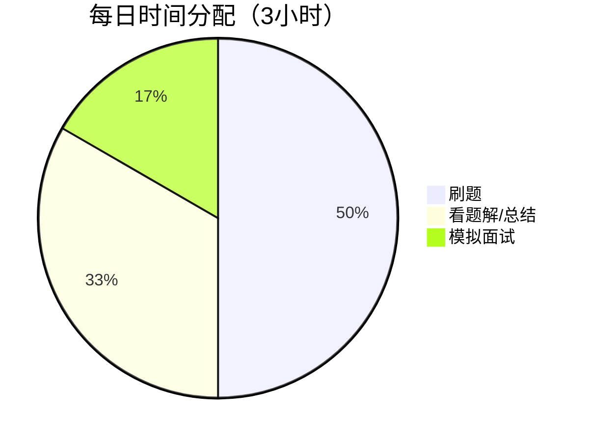
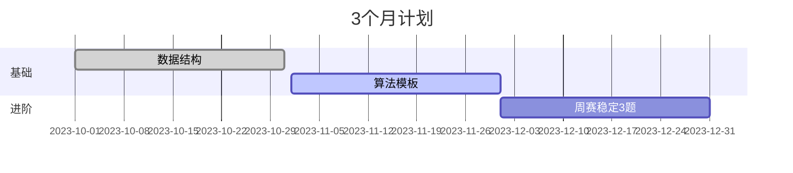

以下是针对不同时间需求的 **高效刷题计划**，结合 **Hot 100 核心题 + 必要扩展**，最大化面试覆盖率。根据你的可用时间选择方案：

---

### **📅 方案 1：紧急冲刺版（7-10天）**
**适用场景**：面试在即，仅能投入 20-30 小时  
**策略**：专攻最高频的 **40 题**（覆盖 70% 面试基础题）  

#### **每日计划（每天 4-5 题）**
| **Day** | **重点分类**         | **必刷题目**                                                                 | **扩展技巧**                     |
|---------|---------------------|-----------------------------------------------------------------------------|----------------------------------|
| 1       | 数组/双指针         | [1.两数之和](https://leetcode.cn/problems/two-sum/), [15.三数之和](https://leetcode.cn/problems/3sum/), [11.盛水容器](https://leetcode.cn/problems/container-with-most-water/) | 哈希优化、左右指针收缩            |
| 2       | 链表操作            | [206.反转链表](https://leetcode.cn/problems/reverse-linked-list/), [141.环形链表](https://leetcode.cn/problems/linked-list-cycle/), [21.合并链表](https://leetcode.cn/problems/merge-two-sorted-lists/) | 虚拟头节点、快慢指针              |
| 3       | 二叉树              | [94.中序遍历](https://leetcode.cn/problems/binary-tree-inorder-traversal/), [101.对称二叉树](https://leetcode.cn/problems/symmetric-tree/), [104.最大深度](https://leetcode.cn/problems/maximum-depth-of-binary-tree/) | 递归 vs 迭代模板                 |
| 4       | DFS/BFS             | [46.全排列](https://leetcode.cn/problems/permutations/), [200.岛屿数量](https://leetcode.cn/problems/number-of-islands/)               | 回溯框架、visited 标记           |
| 5       | 动态规划（一维）    | [70.爬楼梯](https://leetcode.cn/problems/climbing-stairs/), [53.最大子数组和](https://leetcode.cn/problems/maximum-subarray/)          | 状态转移方程推导                 |
| 6       | 滑动窗口/贪心       | [3.无重复字符最长子串](https://leetcode.cn/problems/longest-substring-without-repeating-characters/), [55.跳跃游戏](https://leetcode.cn/problems/jump-game/) | 窗口收缩条件、贪心选择策略        |
| 7       | 补充高频题          | [20.有效括号](https://leetcode.cn/problems/valid-parentheses/), [146.LRU缓存](https://leetcode.cn/problems/lru-cache/)                 | 栈应用、哈希链表设计             |

**加速技巧**：  
- 直接背诵 [代码模板](https://github.com/greyireland/algorithm-pattern)（如二分查找、快速排序）  
- 使用 [LeetCode 题解标签](https://leetcode.cn/tag/) 过滤「面试高频」题解  

---

### **📅 方案 2：稳健提升版（1个月）**
**适用场景**：有 50-100 小时系统准备  
**策略**：Hot 100 全刷 + 企业高频扩展  

#### **阶段安排**
| **阶段**   | **时间** | **重点任务**                                                                 | **工具推荐**                     |
|------------|----------|-----------------------------------------------------------------------------|----------------------------------|
| **Week 1** | 基础巩固 | Hot 100 中的数据结构题（数组/链表/二叉树）                                   | [VisuAlgo](https://visualgo.net) |
| **Week 2** | 算法突破 | Hot 100 的 DFS/BFS/DP 题 + 补充 [剑指 Offer 30题](https://leetcode.cn/problem-list/xb9nqhhg/) | [labuladong 的算法笔记](https://labuladong.github.io/algo/) |
| **Week 3** | 企业专项 | 按目标公司标签刷题（如[字节跳动高频题](https://leetcode.cn/company/bytedance/)）              | LeetCode 公司标签               |
| **Week 4** | 模拟面试 | 每日 2 场模拟（[Pramp](https://www.pramp.com/) 或 [LeetCode 模拟面试](https://leetcode.cn/interview/)） | 计时器 + 白板练习               |

**每日流程示例**：  

---

### **📅 方案 3：长期备战版（3个月）**
**适用场景**：冲击顶级公司算法岗/竞赛基础  
**策略**：Hot 100 + 300 题进阶 + 周赛训练  

#### **核心资源**
1. **分类突破**：  
   - [代码随想录刷题路线](https://programmercarl.com/)（按算法类型分组）  
   - [LeetCode 竞赛题精选](https://leetcode.cn/problem-list/7cyqwuv/)（提升 hard 题能力）  
2. **专项训练**：  
   - 图论：[图论精选题单](https://leetcode.cn/problem-list/e8X3pBZi/)  
   - 动态规划：[DP 问题分类](https://leetcode.cn/problem-list/2cktkvj/)  

#### **里程碑**

---

### **📌 关键建议**
1. **优先级管理**：  
   - 大厂面试 80% 是 Medium 题，Hard 题往往只考高频（如[接雨水](https://leetcode.cn/problems/trapping-rain-water/)）  
   - 如果时间有限，放弃低频难题（如[数位 DP](https://leetcode.cn/problems/numbers-at-most-n-given-digit-set/)）  
2. **效率工具**：  
   - 用 [LeetHub](https://github.com/QasimWani/LeetHub) 自动同步代码到 GitHub  
   - 插件 [LeetCode Rating](https://chrome.google.com/webstore/detail/leetcode-rating/) 查看题目难度分  
3. **复盘方法**：  
   - 错题本记录 **错误类型**（如边界条件、超时原因）  
   - 对比最优解（重点学习时间/空间优化技巧）  

---

### **🎯 最终检查清单**
- [ ] Hot 100 刷完且能默写核心代码  
- [ ] 能口头解释常见算法复杂度（如快排为什么是 O(nlogn)）  
- [ ] 模拟面试时能在 25 分钟内完成 Medium 题  

按此计划执行，即使只刷 Hot 100 也能应对多数面试，扩展题目越多则胜率越高！