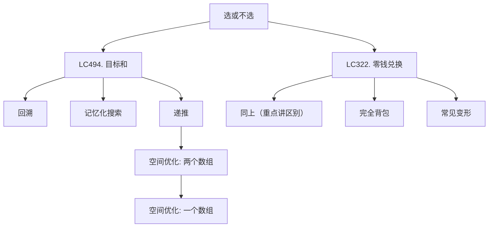

# 动态规划 (灵神)
动态规划的核心就是 **状态定义** 和 **状态转移方程**

状态定义？状态转移方程？
启发思路：选或者不选/选哪个

DP萌新三步：
1. 思考回溯要怎么写
    1.1 入参和返回值
    1.2 递归到哪里
    1.3 递归边界和入口
2. 改成记忆化搜索
3. 1:1 翻译成递推

## DP模型：0-1背包和完全背包
选或不选的思想代表


## 打家劫舍


## 0-1背包
有n个物品，第i个物品的体积为w[i]，价值为v[i]，每个物品至多选一个，求体积和不超过capacity时多最大价值和
**回溯三问：**
1. 当前操作？枚举**第**i个物品选或不选：
                        不选，剩余容量不变；
                        选，剩余容量减少w[i]

2. 子问题？在剩余容量为c时，从**前**i个物品中得到的最大价值和

3. 下一个子问题？分类讨论：
                不选：在剩余容量为c时，从**前**i-1个物品中得到的最大价值和
                选：在剩余容量为c-w[i]时，从i-1个物品中得到的最大价值和
                dfs(i,c)=max(dfs(i-1, c), dfs(i-1, c-w[i])+v[i])

**常见变形**
1. 至多装capacity，求方案数/最大价值和
2. **恰好**装capacity，求**方案数**/最大/最小价值和
3. 至少装capacity，求方案数/最小价值和
dfs(i,c)=dfs(i-1, c) + dfs(i-1, c-w[i])+v[i]  ==》其实就是把上面的最大值改成加法


0-1背包code
```python
# capacity: 背包容量
# w[i]: 第i个物品体积
# v[i]: 第i个物品价值
# 返回：所选物品体积和不超过capacity的前提下，所能得到的最大价值和
def zero_one_knapsack(capcity: int, w: List[int], v: List[int]) -> int:
    n = len(w) # 拿到数组长度

    @cache # 如果用记忆化搜索，就用python的@cache装饰器
    def dfs(i, c) # 定义递归函数
        if i < 0:        # 判断边界条件，i<0此时一个物品都没有了，直接返回0
            return 0
        if c < w[i]:  # 分类讨论，如果选的这个物品的体积已经超过剩余容量c了，只能不选
            return dfs(i-1, c)
        return max(dfs(i-1, c), dfs(i-1, c-w[i]) + v[i]) # 否则取个最大值

    return dfs(n-1, capacity) # 最后return从最后一个物品开始，容量是初始容量
```

